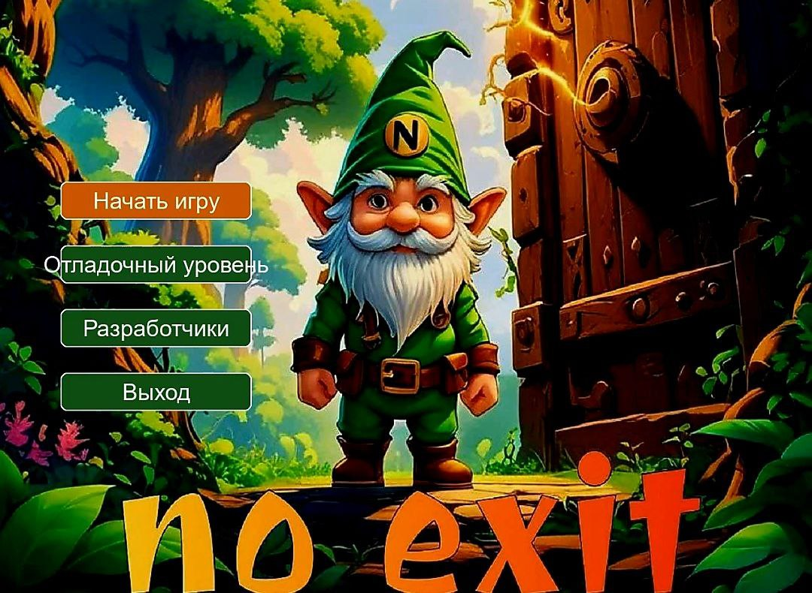
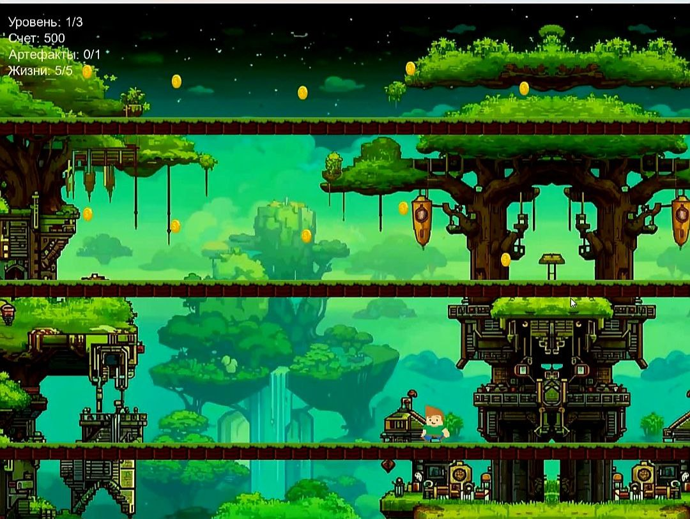

# 2D Platformer на Pygame  
Простой, но увлекательный 2D-платформер, разработанный на Python с использованием библиотеки Pygame. Игрок управляет персонажем, преодолевает препятствия, собирает монеты и проходит уровни с возрастающей сложностью.

---

## 🎮 Особенности
- **Плавное управление** с поддержкой прыжков и движения в воздухе.
- **3 уникальных уровня** с разными типами препятствий (шипы, движущиеся платформы).
- **Система подсчета очков** за сбор монет и бонусов.
- **Анимации персонажа** (бег, прыжок, атака).
- **Звуковое сопровождение** (фоновая музыка, звуковые эффекты).
- **Интерфейс**: отображение жизней, счета и меню паузы.

---

## 📸 Скриншоты
| Заставка                                               | Уровень 1                                               |
|---------------------------------------------------------|---------------------------------------------------------|
|  |  |

---
Мой вклад в разработку:

🔧 Основные реализованные функции:
✅ Система генерации уровней

Разработал логику случайного размещения платформ, врагов и монеток без конфликтов

Создал 3 типа объектов: статичные платформы, движущиеся лифты, платформы с отверстиями

Проработал все ядро игры: создание уровней, подсчет очков, подсчет жизней, отображение интерфейса

✅ Механика взаимодействия объектов

Реализовал композитный класс "Дырка с лифтом", решив проблему некорректного отображения

✅ Архитектура кода

Оптимизировал структуру проекта: разделил логику на классы (GameObject, Player, LevelGenerator)

Реализовал чистый ООП-код с наследованием (например, MovingPlatform → GameObject)

🚀 Уникальные решения:
Проблема: Лифты и дырки на платформах отображались некорректно.
Решение: Создал дочерний класс HoleWithLift, объединяющий оба объекта в один.

Проблема: Рандомная генерация уровней приводила к наложению объектов.
Решение: Написал алгоритм проверки пересечений при спавне.

Проблема: Анимации "тормозили" при большом числе объектов.
Решение: Оптимизировал загрузку спрайтов через кэширование.

📊 Результаты:
Игра стала единственным  проектом на курсе c оценкой "Полноценная игра"(по словам куратора)

Механика получила оценку "нестандартная и продуманная"

Код лег в основу еще 2 учебных проектов одногруппников
---

## ⚙️ Установка
1. **Клонируйте репозиторий**:
   ```bash
   git clone https://github.com/JohnDroben/2d-platformer.git
   cd 2d-platformer
   ```

2. **Установите зависимости**:
   ```bash
   pip install -r requirements.txt
   ```

3. **Запустите игру**:
   ```bash
   python src/main.py
   ```

---

## 🕹 Управление
- **A/D** — движение влево/вправо  
- **Пробел** — прыжок  
- **P** — пауза  
- **ESC** — выход из игры  

---

## 🛠 Структура проекта
```bash
2d-platformer/
├── assets/               # Ресурсы
│   ├── sprites/         # Спрайты персонажа, врагов, объектов
│   ├── sounds/          # Звуки и музыка
│   └── levels/          # Конфиги уровней в формате JSON
├── src/                 # Исходный код
│   ├── main.py          # Точка входа
│   ├── player.py        # Логика персонажа
│   ├── physics.py       # Механика коллизий и гравитации
│   └── ...              # Другие модули
├── requirements.txt     # Зависимости
└── README.md            # Документация
```

---

## 🧰 Технологии
- **Язык**: Python 3.10+
- **Фреймворк**: Pygame 2.6.1
- **Хранение данных**: JSON-конфиги для уровней
- **Графика**: Спрайты в формате PNG (рисованы в Aseprite)
- **Звуки**: WAV (SFX), OGG (музыка)

---

## 🤝 Вклад в проект
Приветствуются пул-реквесты и отчеты об ошибках!  
1. Форкните репозиторий.
2. Создайте ветку для своей фичи: `git checkout -b feature/your-feature`.
3. Зафиксируйте изменения: `git commit -m "Описание фичи"`.
4. Отправьте изменения: `git push origin feature/your-feature`.
5. Создайте Pull Request.

---

## 📜 Лицензия
Проект распространяется под лицензией **MIT**. Подробнее см. в [LICENSE](LICENSE).

---

## 📮 Контакты
Авторы:
Программисты: Семен Чепурнов
Евгений Козулин 
Станислав  Царев
Георгий Дробенюк

Художники: Карапет Гаранян
 Исроил  Алиев

Гейм-дизайнер: Артем Лавров

Поддержка: johndroben@example.com  

---

**Enjoy the game!**

